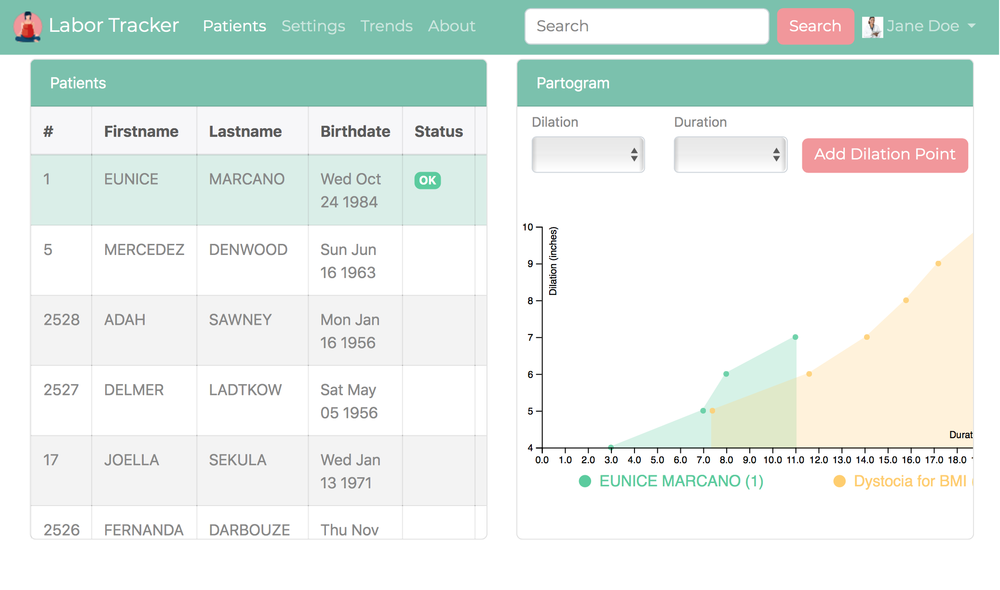
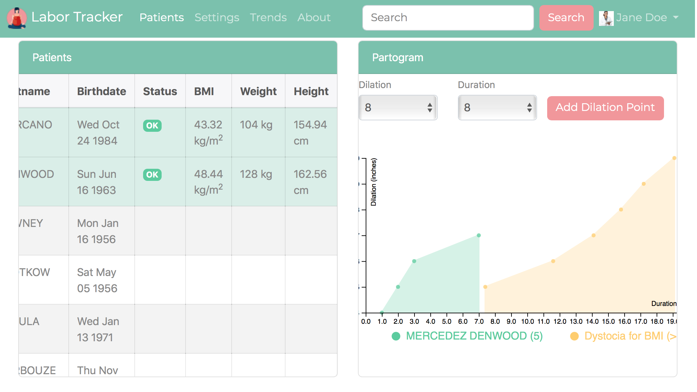
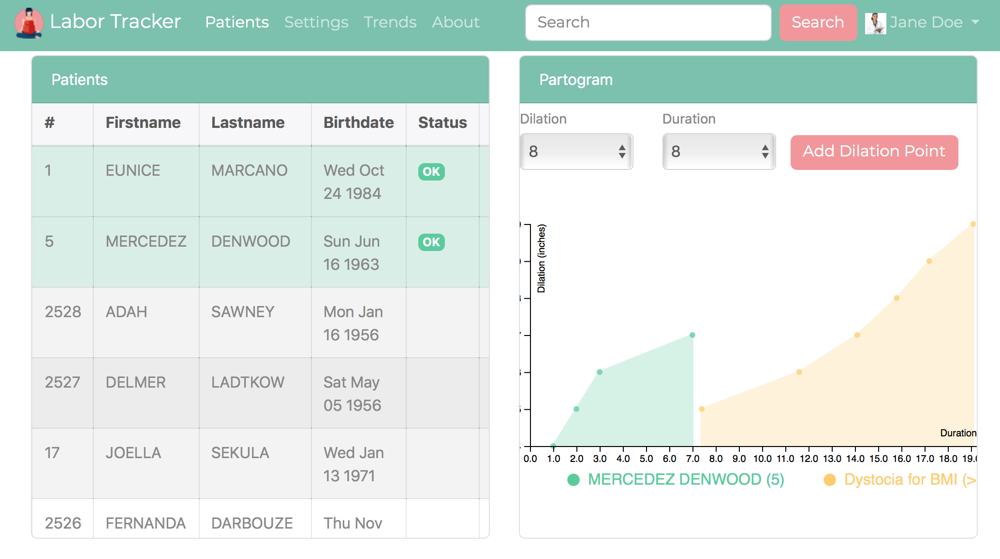
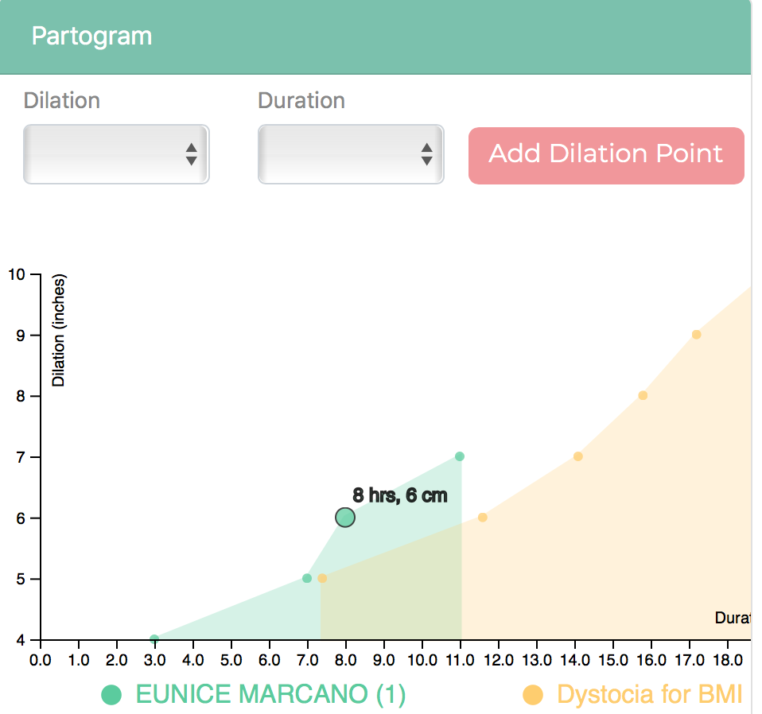
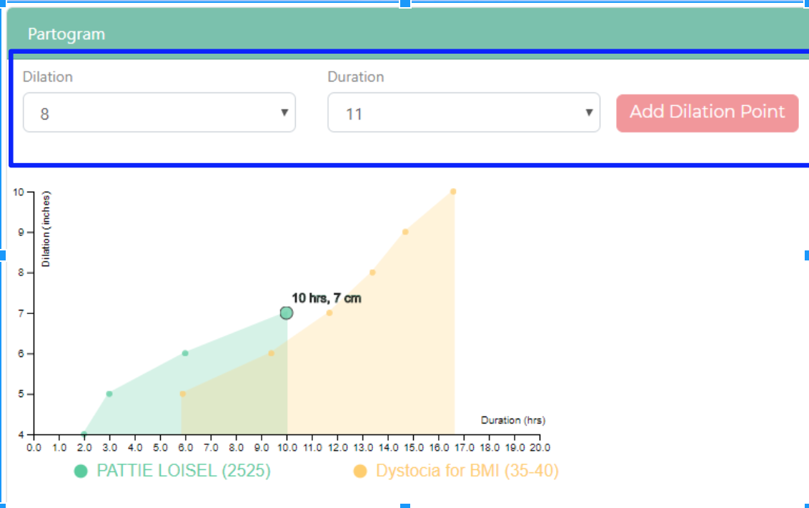

#### Team Name:
Blue FHIR
#### Team Members:
Rascive Grant,
Will Levine,
Bijaya Rijal,
Carl Ashie Annan,
Imran Yousuf
#### Project Name:
Labor-Tracker
#### GitHub Link:
https://github.gatech.edu/gt-hit-fall2017/Labor-Tracker

## User Manual
#### 1. Introduction
The web application is called Labor-Tracker and is used by women in labor to track her cervical dilation and monitor her labor progress.
##### 1.1 Constraint
The scope of the web application is limited to the pre-populated set of users retrieved from a FHIR Database. No new users can be added for this version of the application . The application can be extended to support adding users and creating a login page to allow a private view per user. 

#### 2. Operation Guide
- The UI is simple, user friendly and intuitive and looks like as shown in the following screenshots.
- The women in labor would be taken to the following page as she accesses the Labor-Tracker web application.
 ##### Labor-Tracker UI
 
 - As seen in the UI, the UI shows the individuals measurements on the left hand pane and the corresponding partogram on the right hand pane. The UI comes with pre-loaded data for the first patient in the list (Eunice Marcano as shown in the screenshot above)
 - Select the patient for which the labor-progress partogram has to be generated by clicking on the patient. [For reference: Patient Mercedez Denwood is selected as shown in the screenshot below]
 - Upon selection the application fetches the patient's height, weight and BMI from FHIR and generates a partogram for her based on her BMI.
  - The partogram associated with that patient will be generated on the partogram graph on the right pane of the UI as shown in the image below.
   ##### Labor-Tracker UI Showing Measurements
 
 - The patient would then observe her progress in the graph and see if she is in the dystocia zone. To make it easier for the patient, the application provides that info in the status. [In Denwood's case the status is OK as shown in the image below]
 ##### Labor-Tracker UI Showing Dilation Status
 
 - The patient can also hover over the dilation points in the graph to get the exact dilation in cm for that hour as shown in the image below.
 - The patient can track her progress by entering her measurements using these inputs.  They simply select how many centimeters she is currently dilated and then the number of hours into labor the measurement was taken and then add the data to the chart using the Add Dilation Point button as hsown in the image below.
 ##### Labor-Tracker UI Dilation Point Hover Feature
 
 ##### Labor-Tracker UI Dilation Point Addition
 
 
