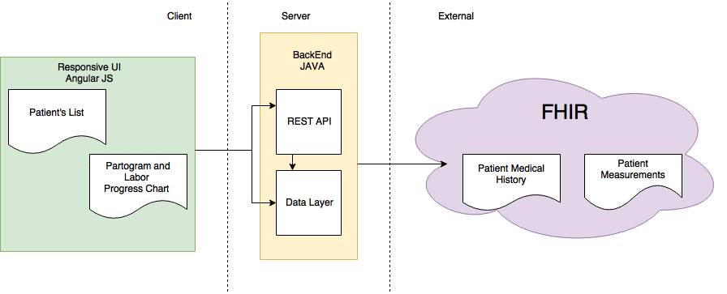
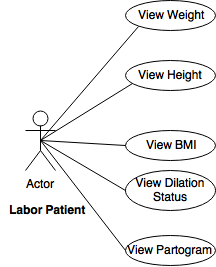

#### Team Name:
Blue FHIR
#### Team Members:
Rascive Grant,
Will Levine,
Bijaya Rijal,
Carl Ashie Annan,
Imran Yousuf
#### Project Name:
Labor-Tracker
#### GitHub Link:
https://github.gatech.edu/gt-hit-fall2017/Labor-Tracker

## LABOR TRACKER
It is a web application to track the cervical dilation of a women in labor to see if it meets the ideal progress based on the partograms generated based on patients BMI. This data can be used by doctors and patients to determine if women would need a cesarian delivery and help minimize that situation as patient can track her progress and act accordingly.

### 1. Definitions
#### 1.1 Partogram
It is a graph plotted against time(in hours) in X-axis and cervical dilation in inches in Y-axis.

#### 1.2 Dystocia
If the cervical dilation doesn't fall in the ideal range based on the BMI range, it is said to be in dystocia zone.

### 2. Design
This section describes the architecutural and low level design and design considerations for the Labor Tracker Project.

#### 2.1 Assumptions
The project has a huge scope. However, the main goal of this application is to get the patient's ideal BMI partogram so that she could use it to compare it against her real progress. The user will be able to see the two lines indicating the cervical dilation progress in the graph. One line would indicate the ideal dilation progress while the other line indicating the real progress. Based on how close the two lines are, patient and doctor would be able to tell how the labor is progressing. Specifically, the primary requirements are as follows.
1. The application must implement FHIR 
2. The application must be able to show the patient's cervical dilation based on her current BMI
3. The application must be able to show the ideal cervical dilation for that BMI
4. The user interface should be intuitive and responsive
5. The application would give an OK Status or WARN based on whether or not she is in dystocia zone

In addition to the requirements, following assumptions were made. 
- The application would be pre-loaded with data for some patients pulled directly from the FHIR
- The application would only work for the patients listed in the FHIR databse 
- BMI for the patient is pulled from the FHIR and used to generate the partogram for that patient and BMI. This is used to satisfy the mandatory implementation of FHIR in the project

#### 2.2 System Environments
- The application is designed to run on any device that supports  Docker 
- The steps to run the application using Docker container is listed in the user manual and specification documents

### 3. Architectural Design
#### 3.1 Architectural Diagram
 

#### 3.2 UseCase Diagram
 

### 4 Project Elements
The project has 3 elements, Front End, Back End to interact with FHIR and Build and compile with Maven and Docker.

#### 4.1 Front End
Front End code is writtten using Angular JS. The source code for all the front end is in clients/web folder. Developer could work on his developmet environment setting up nodejs in his local. After installing npm and running 'ng serve' from the web folder, developer can access the front end UI going to localhost:4200. Details for testing the front end are all mentioned in the Readme file inside the web folder. 
The UI is intuitive and the screen has two major components to it. The one on the left shows all the labor patient's details like height, weight ,BMI and dilation status. The right hand pane in the UI shows the partogram for her which has both the lines showing her real progress as compared to her ideal graph. 

#### 4.2 Back End
Back end is written in Java. The source code for the Java component is in src folder in the root of the repository. FHIR integration is done in this element. Getting the connection to FHIR server to retrieve height, weight and BMI of set patients is done in this section. The code is compiled using maven.

#### 4.3 Build, Compile and Run 
All the build files are located in the root of the repository. The pom.xml file is used to build and compile the java component. The application is run using a Dockerfile in a docker container. The Dockerfile has all the specifics defined to install the toolsets required for running the application . It has steps to install node angular-cli to run the front end server and then steps are defined to run ng build and spring-boot for starting the application. 

